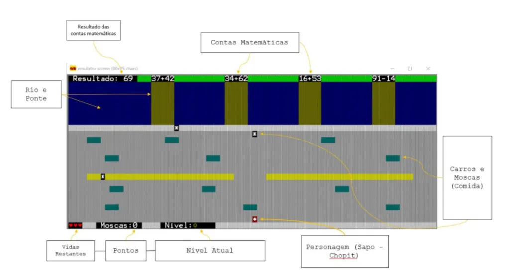
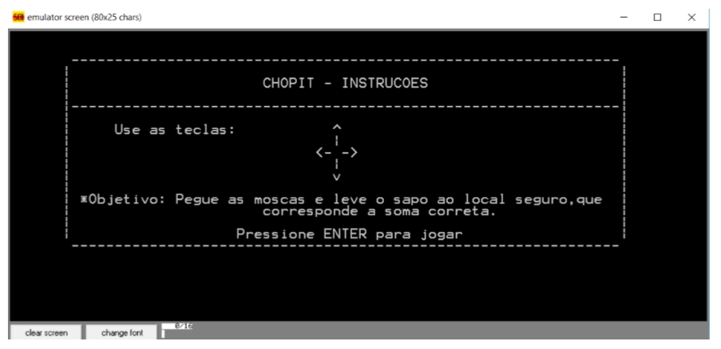

# Chopit 🐸

Jogo desenvolvido em **Assembly x86** utilizando o **Emu8086**, rodando em modo de 16 bits (compatível com sistemas 32 bits). O personagem principal é um sapo chamado Chopit que precisa atravessar a rua, coletar moscas e responder operações matemáticas para avançar de nível.

---

## Como Jogar

| Tecla | Ação |
|-------|------|
| ↑ ↓ ← → | Mover o sapo |
| `ESC` | Sair do jogo |

O objetivo é:
1. Coletar todas as moscas (`*`) espalhadas pela rua para ganhar pontos
2. Escolher a ponte que corresponde à resposta correta da operação matemática exibida no canto superior esquerdo
3. Atravessar sem ser atingido por carros ou cair no rio contaminado

---

## Mecânicas

- **Pontuação** — cada mosca coletada adiciona pontos ao placar
- **Vidas** — o jogador possui um número limitado de vidas (❤️) - colisão com carros ou o rio contaminado consome uma vida
- **Game Over** — ao perder todas as vidas o jogo reinicia
- **Progressão** — as operações matemáticas ficam mais difíceis a cada nível superado

---

## Detalhes Técnicos

| Item | Detalhe |
|------|---------|
| Linguagem | Assembly x86 (MASM/Emu8086) |
| Modo de vídeo | Texto — INT 10h (80×25, 16 cores) |
| Fundo / cenário | Caractere `B2h` com cores distintas por elemento |
| Sapo | Caractere `04h` |
| Moscas | Caractere `2Ah` |
| Entrada | INT 21h (teclado) |
| Arquivos | `Jogo.asm`, `Macro.asm` |

---

## Como Executar

1. Instale o [Emu8086](https://emu8086-microprocessor-emulator.en.softonic.com/)
2. Abra `Jogo.asm` no emulador
3. Compile e execute (`F5` ou botão *Run*)
